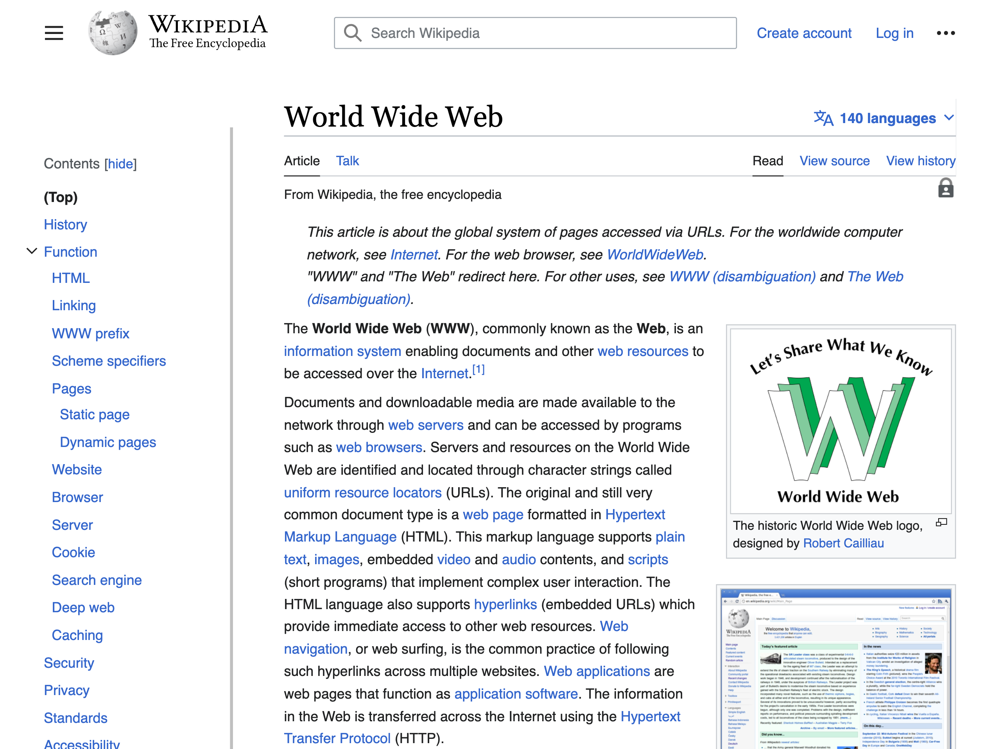
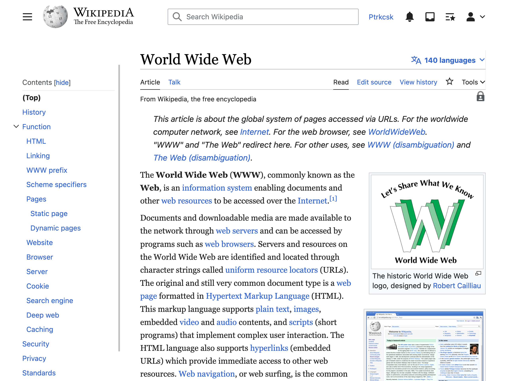

# Wikipedia Vector 2022 Refined

​This my [custom user CSS](https://en.wikipedia.org/wiki/Help:User_style) which (in my opinion) improves [Wikipedia&rsquo;s 2023 desktop redesign](https://wikimediafoundation.org/news/2023/01/18/wikipedia-gets-a-fresh-new-look-first-desktop-update-in-a-decade-puts-usability-at-the-forefront/), known internally as the [Vector 2022 skin](https://en.wikipedia.org/wiki/Wikipedia:Vector_2022)

## Improvements

### Increase body font size from 14px to 16px

I find Vector 2022&rsquo;s default body font size difficult to read below 110% zoom, a problem I don&rsquo;t have on other websites

### Use [system font stack](https://css-tricks.com/snippets/css/system-font-stack/) instead of Helvetica and Georgia

I use macOS and I find [Apple&rsquo;s SF and New York fonts](https://developer.apple.com/fonts/) to be friendlier and more polished than Vector 2022&rsquo;s default fonts

### Use serif font for body content instead of sans-serif

I prefer serif fonts when reading long-form content

## Screenshots

| Before | After |
|---|---|
|  |  |

## Usage

1. Log in to Wikipedia
1. Go to your [appearance preferences](https://en.wikipedia.org/wiki/Special:Preferences#mw-prefsection-rendering)
1. Under **Skin**, click the **Custom CSS** link for the **Vector (2022)** skin (here&rsquo;s a direct link : [Special:MyPage/vector-2022.css](https://en.wikipedia.org/wiki/Special:MyPage/vector-2022.css))
1. Click **Edit source**
1. Copy and paste the CSS code below to your page
1. Click **Publish changes**

## Code

Here&rsquo;s the CSS :

```css
/*
 * use system fonts
 * see https://tailwindcss.com/docs/font-family
*/
:root {
	--font-sans: ui-sans-serif, system-ui, -apple-system, BlinkMacSystemFont, "Segoe UI", Roboto, "Helvetica Neue", Arial, "Noto Sans", sans-serif, "Apple Color Emoji", "Segoe UI Emoji", "Segoe UI Symbol", "Noto Color Emoji";
	--font-serif: ui-serif, Georgia, Cambria, "Times New Roman", Times, serif;
	--font-mono: ui-monospace, SFMono-Regular, Menlo, Monaco, Consolas, "Liberation Mono", "Courier New", monospace;
}

html, body {
	font-family: var(--font-sans);
}

pre, code, tt, kbd, samp, .mw-code {
	font-family: var(--font-mono);
}

/* use serif font family for body content */
.pre-content h1, .content h1, .content h2,
.mw-body h1, .mw-body-content h1, .mw-body-content h2,
.mw-body-content p {
	font-family: var(--font-serif);
}

/* increase body font size */
.vector-body,
.vector-body p {
	font-size: 1rem;
}
```
